# Hatch105 Thesis Ranker

Inspectable ranking system for the [Hatch105 Build Challenge](Initial-dataset/Hatch105%20Build%20Challenge.html): score **50 Happy Stack Labs theses** on **Hatch Fit**, explain every placement, **re-rank the full cohort** when new ideas arrive, and audit every decision in committed JSON.

| Stack | Role |
|-------|------|
| **Next.js 16** (App Router, Turbopack) | UI, SSR idea pages, Route Handlers |
| **TypeScript + Zod** | Schemas for theses, scores, LLM output |
| **Vercel AI SDK** + **`@ai-sdk/google`** | Streaming Ask dataset chat only |
| **Google Gemini** (`gemini-2.0-flash` default) | `/api/chat` — grounded Q&A over ranking snapshot |
| **Deterministic rubric** (`lib/heuristic.ts`, `lib/expansion.ts`) | Scoring, re-rank, detail pages — zero LLM calls |
| **Vercel Blob** (production) | Durable live re-rank extras, scores, research |
| **Filesystem** (local + `/tmp` overlay) | Committed `scores/`, writable jobs, research cache |

<p align="center">
  
  <strong>Ask dataset chat</strong> uses Google Gemini; ranking and re-rank are fully deterministic
</p>

---

## Table of contents

1. [Product surface](#product-surface)
2. [Gemini in Hatch105](#gemini-in-hatch105)
3. [System context (C4)](#system-context-c4)
4. [Deployment architecture](#deployment-architecture)
5. [Repository layout](#repository-layout)
6. [Data model](#data-model)
7. [Persistence layer](#persistence-layer)
8. [Ranking & Hatch Fit](#ranking--hatch-fit)
9. [Scoring pipeline](#scoring-pipeline)
10. [Hard gates (deterministic)](#hard-gates-deterministic)
11. [Research subsystem](#research-subsystem)
12. [Live re-rank](#live-re-rank)
13. [Idea detail pages](#idea-detail-pages)
14. [Grounded chat](#grounded-chat)
15. [Client-side ranking sync](#client-side-ranking-sync)
16. [API reference](#api-reference)
17. [Frontend architecture](#frontend-architecture)
18. [Environment variables](#environment-variables)
19. [Quick start](#quick-start)
20. [Scripts & tests](#scripts--tests)
21. [Deploy on Vercel](#deploy-on-vercel)
22. [Confidentiality & license](#confidentiality--license)

---

## Product surface

| Capability | Route / location | Primary modules |
|------------|------------------|-----------------|
| Ranked list (base 50 + extras) | `/` → **All ideas** | `RankingDashboard`, `GET /api/ranking` |
| Written rubric + gates | [CRITERIA.md](CRITERIA.md) | `lib/gates.ts`, `lib/criteria.ts` |
| Company profile + cohort charts | `/ideas/H-XX` | `ThesisDetailPage`, `lib/thesis-detail.ts` |
| Live re-rank (instant deterministic scoring) | **Live re-rank** tab | `RerankPanel`, `lib/rerank-batch.ts` |
| Grounded dataset chat (`@` mentions) | `/chat` | `lib/dataset-context.ts`, `POST /api/chat` |
| Compare (up to 4) | `/compare` | `lib/compare-store.tsx` |
| Portfolio board (localStorage) | **Portfolio** tab | `PortfolioBoard` |
| Human overrides | Company page | `overrides/H-XX.json`, `POST /api/overrides/[ref]` |

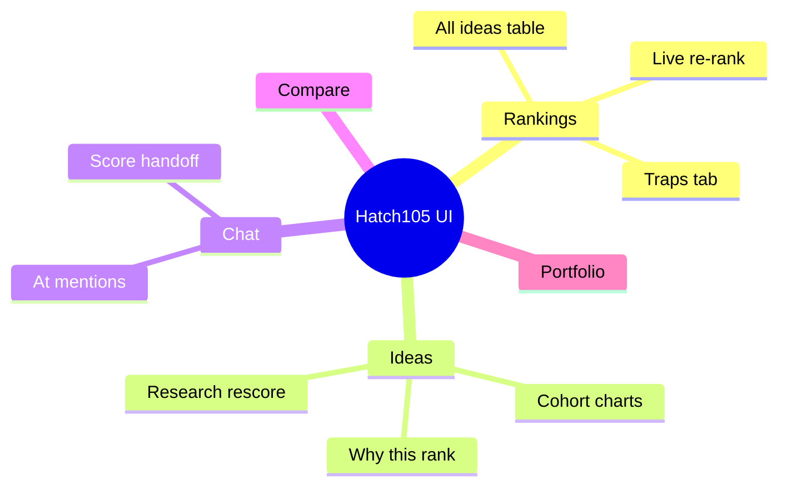
```mermaid
mindmap
  root((Hatch105 UI))
    Rankings
      All ideas table
      Traps tab
      Live re-rank
    Ideas
      Cohort charts
      Why this rank
      Research rescore
    Chat
      At mentions
      Score handoff
    Compare
    Portfolio
```

---

## Intelligence split

| Layer | Entry point | How it works |
|-------|-------------|--------------|
| **Ranking / re-rank** | `RerankPanel`, `scripts/rank.ts`, `scoreThesisForRanking` | `lib/heuristic.ts` + `lib/expansion.ts` — regex rubric, gates, templated snapshot/v1 plan |
| **Ask dataset chat** | `POST /api/chat` | Gemini `streamText` over pre-built `RANKING.md` snapshot |
| **Legacy base-50 scores** | Committed `scores/H-XX.json` | Historical Groq/Gemini narratives kept as-is (no runtime API) |

Chat UI uses the official 2025 Gemini spark in [`public/gemini-logo.svg`](public/gemini-logo.svg) (`GeminiIcon`, `GeminiAvatar` on `/chat` only).

### Scoring pipeline (example screenshot)

Terminal output from seeding the base cohort with an LLM — each thesis becomes an auditable `scores/H-XX.json` (screenshot from an earlier Groq seed run):

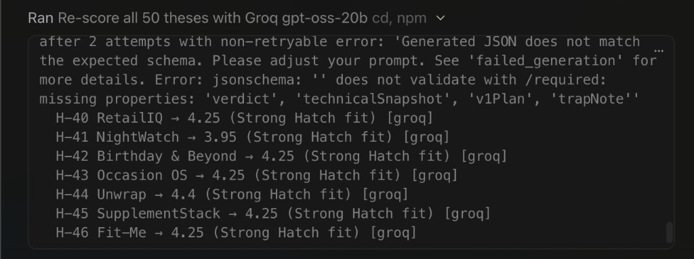

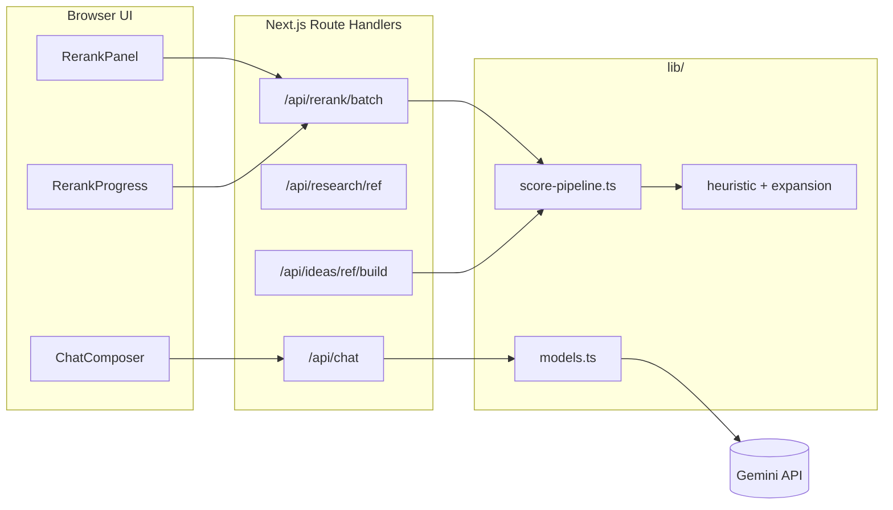
```mermaid
flowchart LR
  subgraph UI["Browser UI"]
    RP[RerankPanel]
    RProg[RerankProgress]
    Chat[ChatComposer]
  end

  subgraph API["Next.js Route Handlers"]
    Batch["/api/rerank/batch"]
    Research["/api/research/ref"]
    ChatAPI["/api/chat"]
    Build["/api/ideas/ref/build"]
  end

  subgraph Lib["lib/"]
    SP[score-pipeline.ts]
    HEU[heuristic + expansion]
    Models[models.ts]
  end

  GeminiAPI[(Gemini API)]

  RP --> Batch
  RProg --> Batch
  Chat --> ChatAPI
  Batch --> SP --> HEU
  Build --> SP
  ChatAPI --> Models --> GeminiAPI
```

---

## System context (C4)

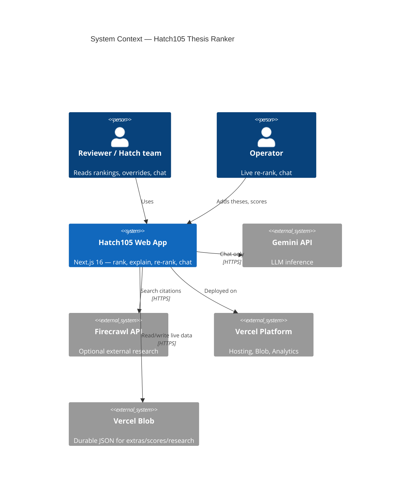
```mermaid
C4Context
  title System Context — Hatch105 Thesis Ranker

  Person(reviewer, "Reviewer / Hatch team", "Reads rankings, overrides, chat")
  Person(operator, "Operator", "Live re-rank, chat")

  System(hatch105, "Hatch105 Web App", "Next.js 16 — rank, explain, re-rank, chat")

  System_Ext(groq, "Gemini API", "LLM inference")
  System_Ext(firecrawl, "Firecrawl API", "Optional external research")
  System_Ext(vercel, "Vercel Platform", "Hosting, Blob, Analytics")
  System_Ext(blob, "Vercel Blob", "Durable JSON for extras/scores/research")

  Rel(reviewer, hatch105, "Uses")
  Rel(operator, hatch105, "Adds theses, scores")
  Rel(hatch105, groq, "Chat only", "HTTPS")
  Rel(hatch105, firecrawl, "Search citations", "HTTPS")
  Rel(hatch105, vercel, "Deployed on")
  Rel(hatch105, blob, "Read/write live data", "HTTPS")
```

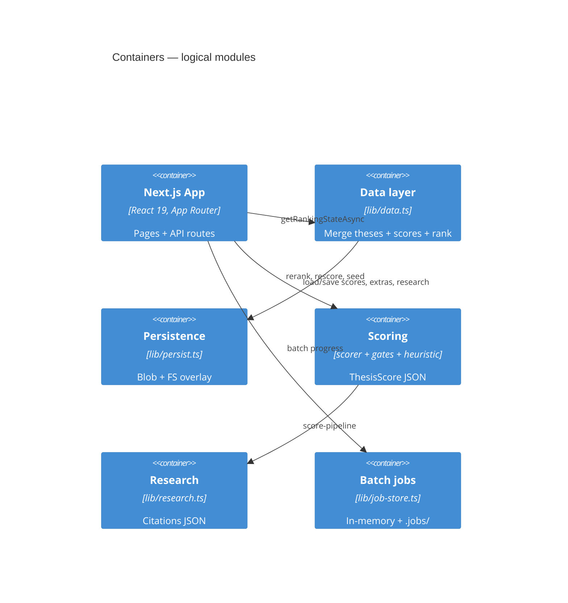
```mermaid
C4Container
  title Containers — logical modules

  Container(web, "Next.js App", "React 19, App Router", "Pages + API routes")
  Container(data, "Data layer", "lib/data.ts", "Merge theses + scores + rank")
  Container(persist, "Persistence", "lib/persist.ts", "Blob + FS overlay")
  Container(score, "Scoring", "scorer + gates + heuristic", "ThesisScore JSON")
  Container(research, "Research", "lib/research.ts", "Citations JSON")
  Container(jobs, "Batch jobs", "lib/job-store.ts", "In-memory + .jobs/")

  Rel(web, data, "getRankingStateAsync")
  Rel(data, persist, "load/save scores, extras, research")
  Rel(web, score, "rerank, rescore, seed")
  Rel(score, research, "score-pipeline")
  Rel(web, jobs, "batch progress")
```

---

## Deployment architecture

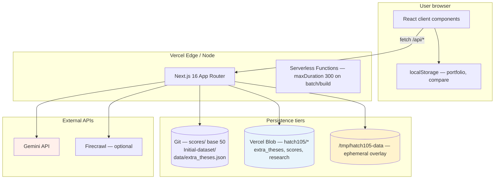
```mermaid
flowchart TB
  subgraph Browser["User browser"]
    React[React client components]
    LS[localStorage — portfolio, compare]
  end

  subgraph Vercel["Vercel Edge / Node"]
    Next[Next.js 16 App Router]
    Fn[Serverless Functions — maxDuration 300 on batch/build]
  end

  subgraph Storage["Persistence tiers"]
    Repo[(Git — scores/ base 50\nInitial-dataset/\ndata/extra_theses.json)]
  Blob[(Vercel Blob — hatch105/*\nextra_theses, scores, research)]
    Tmp[(/tmp/hatch105-data — ephemeral overlay)]
  end

  subgraph External["External APIs"]
    GroqAPI[Gemini API]
    FC[Firecrawl — optional]
  end

  React -->|fetch /api/*| Next
  Next --> Repo
  Next --> Blob
  Next --> Tmp
  Next --> GroqAPI
  Next --> FC
  React --> LS

  style Blob fill:#e8f4fc
  style Tmp fill:#fff3cd
  style GroqAPI fill:#fff0eb
```

| Environment | Writable root | Durable extras? |
|-------------|---------------|-----------------|
| **Local dev** | `process.cwd()` | Yes — commit `scores/`, `data/extra_theses.json` |
| **Vercel without Blob** | `/tmp/hatch105-data` | **No** — cold start loses live re-rank |
| **Vercel + Blob** | `/tmp` + **Blob mirror** | **Yes** — `BLOB_READ_WRITE_TOKEN` required |

---

## Repository layout

```
Initial-dataset/              Challenge brief + candidate_theses.{json,csv}
CRITERIA.md                   Human-readable rubric (source of truth)
fixtures/new_theses.json      Sample H-51…H-55 for live re-rank drills
scores/                       Committed ThesisScore JSON (base 50)
data/
  extra_theses.json           Live re-rank thesis rows (merge target)
  competitors.json            Grounded "vs X" cache for research
research/                     Optional committed research snapshots
overrides/                    Human override records per ref
docs/images/
  groq-seed-scoring.png       README / docs screenshot
public/
  gemini-logo.svg               Groq mark for UI
lib/
  data.ts                     loadAllTheses*, getRankingState*, scores/research I/O
  persist.ts                  Vercel Blob + FS dual-write
  writable-root.ts            cwd vs /tmp vs HATCH105_WRITABLE_DIR
  scorer.ts                   Gemini structured output + heuristic routing
  heuristic.ts                Deterministic fallback scorer
  gates.ts                    Post-LLM hard gates + criterion caps
  score-pipeline.ts           research → full Groq score (live re-rank)
  rerank-batch.ts             Batch job runner + finalizeRanking
  job-store.ts                BatchJob state (.jobs/ + memory)
  research.ts                 Grounded vs Firecrawl external
  rank.ts                     sort by fit → RankedThesis[]
  dataset-context.ts          Chat system context builder
  teams.ts                    @mention teams from ranking
  ensure-thesis-profile.ts    Backfill extras on idea page / build API
  ranking-sync.ts             hatch105-ranking-updated browser event
  thesis-insights.ts           Why rank, similar, tension, trap stories
app/
  page.tsx                    Rankings dashboard
  ideas/[ref]/page.tsx        Company profile (SSR, dynamic)
  chat/ compare/              Secondary surfaces
  api/                        Route Handlers (see API reference)
components/
  RankingDashboard.tsx        Tabs: ideas, traps, rerank, portfolio
  RerankPanel.tsx             Live re-rank + GroqScoringProgress
  thesis/                     Detail charts, building state, actions
  chat/                       Composer, GroqAvatar, handoff modal
scripts/                      seed-scores.ts, rank.ts
tests/                        Vitest — gates, heuristic golden, mentions
```

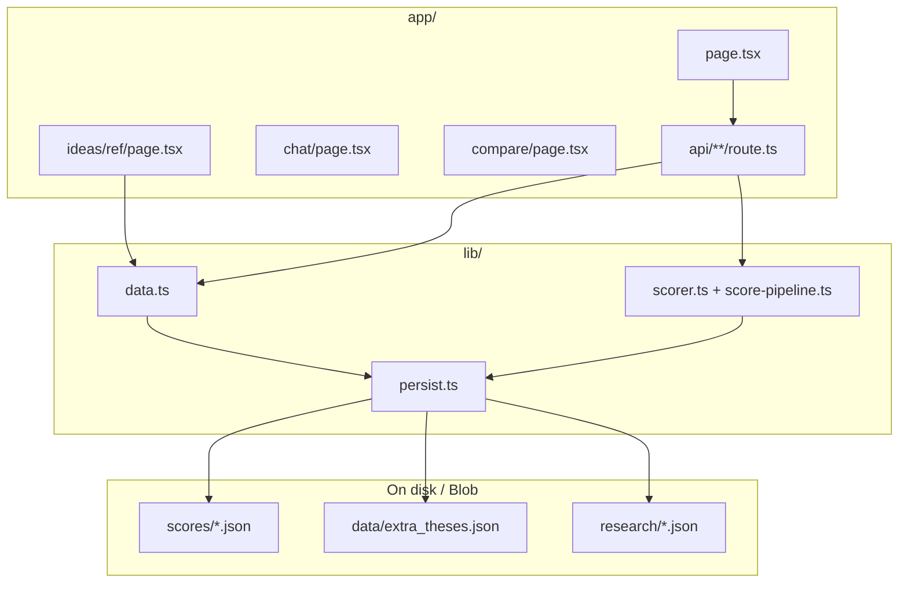
```mermaid
graph TB
  subgraph App["app/"]
    P[page.tsx]
    ID[ideas/ref/page.tsx]
    CH[chat/page.tsx]
    CP[compare/page.tsx]
    API[api/**/route.ts]
  end

  subgraph Lib["lib/"]
    DATA[data.ts]
    PERSIST[persist.ts]
    SCORE[scorer.ts + score-pipeline.ts]
  end

  subgraph Disk["On disk / Blob"]
    SC[scores/*.json]
    ET[data/extra_theses.json]
    RS[research/*.json]
  end

  P --> API
  ID --> DATA
  API --> DATA
  DATA --> PERSIST
  PERSIST --> SC
  PERSIST --> ET
  PERSIST --> RS
  API --> SCORE
  SCORE --> PERSIST
```

---

## Data model

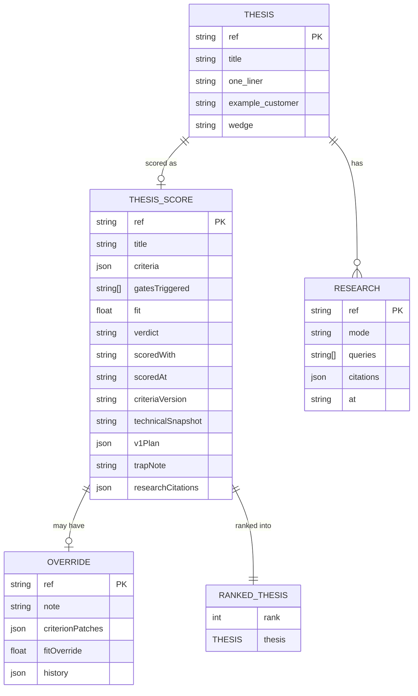
```mermaid
erDiagram
  THESIS ||--o| THESIS_SCORE : "scored as"
  THESIS ||--o{ RESEARCH : "has"
  THESIS_SCORE ||--o| OVERRIDE : "may have"
  THESIS_SCORE ||--|| RANKED_THESIS : "ranked into"

  THESIS {
    string ref PK
    string title
    string one_liner
    string example_customer
    string wedge
  }

  THESIS_SCORE {
    string ref PK
    string title
    json criteria
    string[] gatesTriggered
    float fit
    string verdict
    string scoredWith
    string scoredAt
    string criteriaVersion
    string technicalSnapshot
    json v1Plan
    string trapNote
    json researchCitations
  }

  RANKED_THESIS {
    int rank
    THESIS thesis
  }

  RESEARCH {
    string ref PK
    string mode
    string[] queries
    json citations
    string at
  }

  OVERRIDE {
    string ref PK
    string note
    json criterionPatches
    float fitOverride
    json history
  }
```

### Merge order: building the cohort

`loadAllThesesAsync()` and `loadAllScoresAsync()` construct the **single source of truth** used by every API route and SSR page.

```mermaid
flowchart TD
  A[loadCandidateTheses] --> M[thesisByRef Map]
  B[loadExtraThesesAsync] --> M
  C[In-memory batch theses] --> M
  D[loadAllScoresAsync] --> S[scoreByRef Map]
  S -->|stub if missing thesis| M

  M --> T[All Thesis[]]
  S --> R[rankScores scores + theses]
  R --> BS[buildRankingState]
  BS --> RS[RankingState — ranked + metadata]

  subgraph ScoresRead["loadAllScoresAsync order"]
    R1[1. scores/ in repo — base 50]
    R2[2. persistList scores/ — Blob + writable]
    R3[3. writable scores/ overlay — highest priority]
    R1 --> R2 --> R3
  end
```

---

## Persistence layer

[`lib/persist.ts`](lib/persist.ts) implements **dual-write**: every `persistPut` writes to Vercel Blob (when `BLOB_READ_WRITE_TOKEN` is set) **and** the local writable root from [`lib/writable-root.ts`](lib/writable-root.ts).

| Blob key prefix | File | Contents |
|-----------------|------|----------|
| `hatch105/extra_theses.json` | `data/extra_theses.json` | Array of `Thesis` from live re-rank |
| `hatch105/scores/H-XX.json` | `scores/H-XX.json` | `ThesisScore` |
| `hatch105/research/H-XX.json` | `research/H-XX.json` | `ResearchResult` |

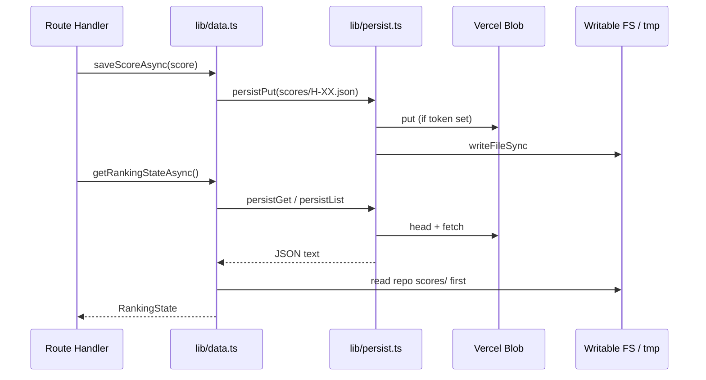
```mermaid
sequenceDiagram
  participant API as Route Handler
  participant Data as lib/data.ts
  participant Persist as lib/persist.ts
  participant Blob as Vercel Blob
  participant FS as Writable FS / tmp

  API->>Data: saveScoreAsync(score)
  Data->>Persist: persistPut(scores/H-XX.json)
  Persist->>Blob: put (if token set)
  Persist->>FS: writeFileSync
  API->>Data: getRankingStateAsync()
  Data->>Persist: persistGet / persistList
  Persist->>Blob: head + fetch
  Persist-->>Data: JSON text
  Data->>FS: read repo scores/ first
  Data-->>API: RankingState
```

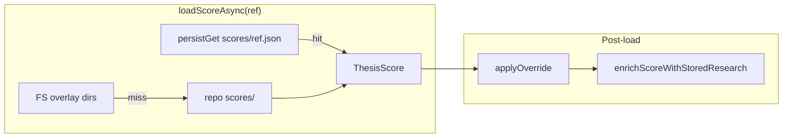
```mermaid
flowchart LR
  subgraph ReadPath["loadScoreAsync(ref)"]
    P1[persistGet scores/ref.json]
    P2[FS overlay dirs]
    P3[repo scores/]
    P1 -->|hit| OUT[ThesisScore]
    P2 -->|miss| P3
    P3 --> OUT
  end

  subgraph Enrich["Post-load"]
    OVR[applyOverride]
    RES[enrichScoreWithStoredResearch]
    OUT --> OVR --> RES
  end
```

---

## Ranking & Hatch Fit

**North star:** Which thesis should a **3-person Hatch team** ship in **10 weeks** with revenue inside **10 weeks**, without trap pivots.

### Weighted Hatch Fit

| Criterion | Weight | Notes |
|-----------|--------|-------|
| Buildability (3d · 3w · 10w) | 25% | From `v1Plan` when present |
| Speed to revenue | 20% | |
| Wedge clarity | 15% | |
| Distribution | 15% | |
| Trap risk | 10% | **Inverted** in fit math |
| Expansion | 15% | |

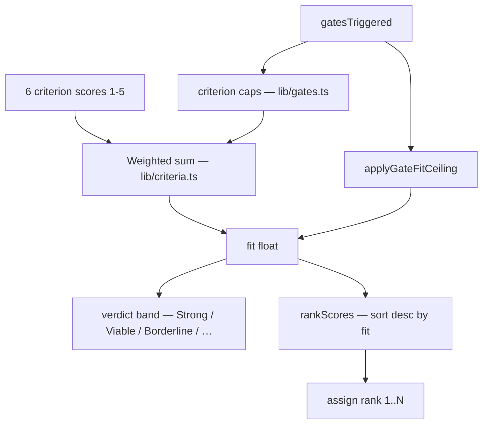
```mermaid
flowchart TD
  C1[6 criterion scores 1-5] --> W[Weighted sum — lib/criteria.ts]
  W --> F[fit float]
  F --> V[verdict band — Strong / Viable / Borderline / …]
  G[gatesTriggered] --> CAP[criterion caps — lib/gates.ts]
  CAP --> W
  G --> CEIL[applyGateFitCeiling]
  CEIL --> F
  F --> SORT[rankScores — sort desc by fit]
  SORT --> RANK[assign rank 1..N]
```

```mermaid
flowchart LR
  subgraph Inputs
    TS[ThesisScore[]]
    TH[Thesis[]]
  end
  subgraph lib_rank["lib/rank.ts"]
    SORT[sort by fit desc, ref tie-break]
    MAP[attach thesis + rank index]
  end
  subgraph Output
    RT[RankedThesis[]]
    MD[RANKING.md via lib/markdown.ts]
  end
  TS --> SORT
  TH --> MAP
  SORT --> MAP --> RT --> MD
```

---

## Scoring pipeline

All ranking work is **deterministic** — no Gemini calls.

| Module | Role |
|--------|------|
| [`lib/heuristic.ts`](lib/heuristic.ts) | Six criterion scores from regex + ref calibration |
| [`lib/expansion.ts`](lib/expansion.ts) | `technicalSnapshot`, `v1Plan`, `trapNote` templates |
| [`lib/gates.ts`](lib/gates.ts) | Hard gates + fit ceiling |
| [`lib/score-pipeline.ts`](lib/score-pipeline.ts) | `runResearch` + `scoreThesisHeuristic` + citations |

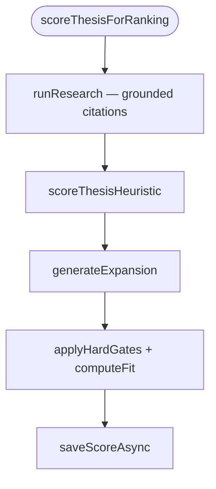
```mermaid
flowchart TD
  START([scoreThesisForRanking]) --> RES[runResearch — grounded citations]
  RES --> HEU[scoreThesisHeuristic]
  HEU --> EXP[generateExpansion]
  EXP --> GATE[applyHardGates + computeFit]
  GATE --> SAVE[saveScoreAsync]
```

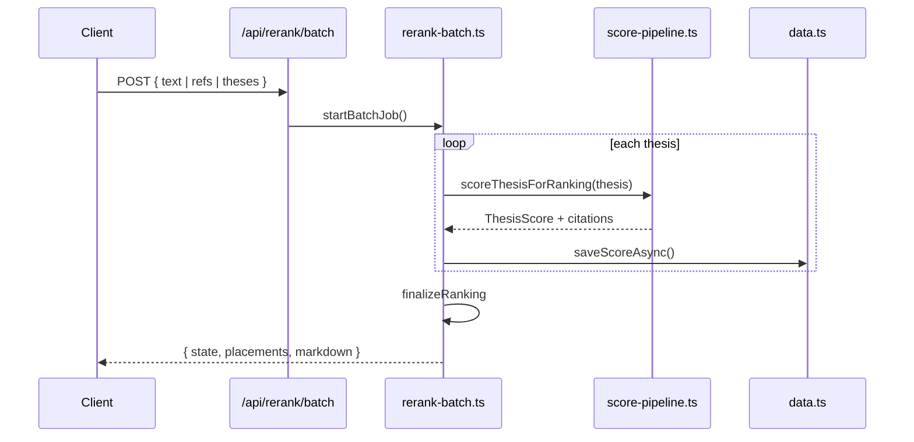
```mermaid
sequenceDiagram
  participant Client
  participant Batch as /api/rerank/batch
  participant RB as rerank-batch.ts
  participant SP as score-pipeline.ts
  participant Data as data.ts

  Client->>Batch: POST { text | refs | theses }
  Batch->>RB: startBatchJob()
  loop each thesis
    RB->>SP: scoreThesisForRanking(thesis)
    SP-->>RB: ThesisScore + citations
    RB->>Data: saveScoreAsync()
  end
  RB->>RB: finalizeRanking
  RB-->>Client: { state, placements, markdown }
```

---

## Hard gates (deterministic)

Gates run **after** the LLM (or heuristic) and **before** final fit. They are pure TypeScript — auditable, testable, never prompt-dependent.

| Gate ID | Trigger (summary) | Effect |
|---------|-------------------|--------|
| `G3D` | Generative 3D / AR try-on wedge | Cap buildability ≤ 2 |
| `REALTIME_AI` | Realtime API / voice clone / &lt;300ms | Cap buildability ≤ 2 |
| `INCUMBENT_WAR` | vs Yotpo/Gorgias/Klaviyo + price war | Cap distribution |
| `POS_ENTERPRISE` | POS / enterprise retail scope | Cap speed + buildability |
| `AUTO_REPRICE` | Auto-repricing / dynamic pricing trap | Cap expansion |

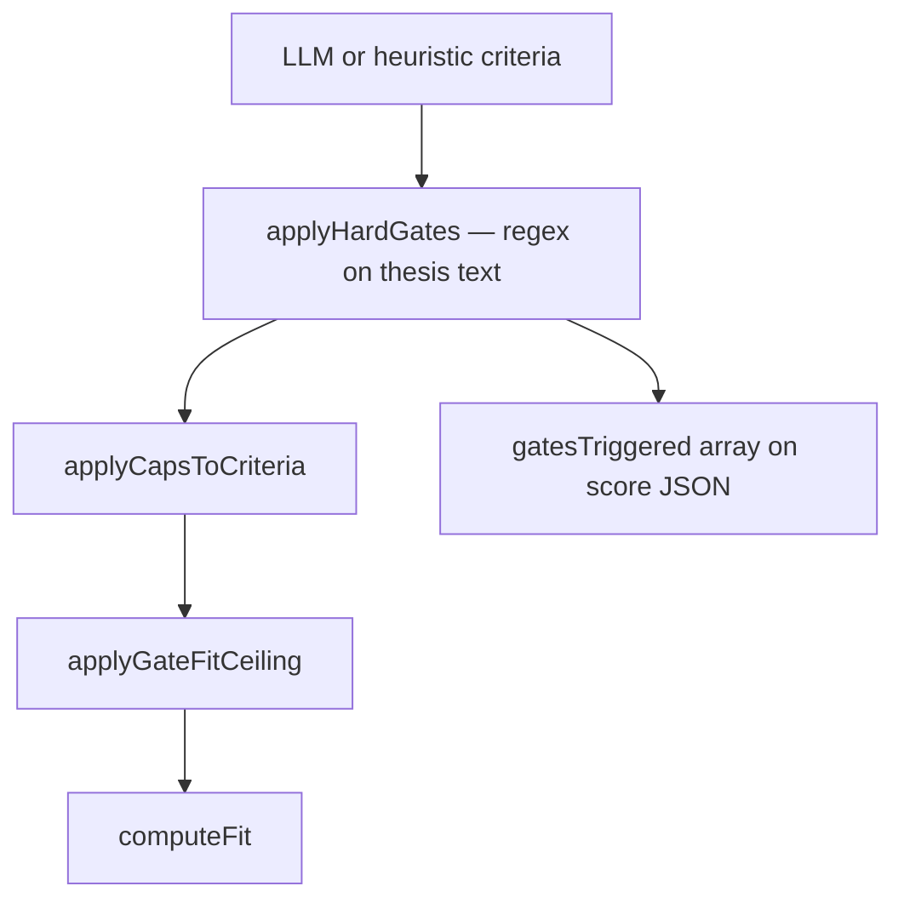
```mermaid
flowchart TD
  LLM[LLM or heuristic criteria] --> HG[applyHardGates — regex on thesis text]
  HG --> CAP[applyCapsToCriteria]
  CAP --> CEIL[applyGateFitCeiling]
  CEIL --> FIT[computeFit]
  HG --> GT[gatesTriggered array on score JSON]
```

---

## Research subsystem

[`lib/research.ts`](lib/research.ts) produces `ResearchResult` (queries + citations) stored via `saveResearchAsync`.

| Mode | When | Source |
|------|------|--------|
| **grounded** (default) | `RESEARCH_DEFAULT_MODE=grounded` | Thesis wedge, `data/competitors.json`, Shopify surface checks |
| **external** | `RESEARCH_DEFAULT_MODE=external` + `FIRECRAWL_API_KEY` | Firecrawl search API; falls back to grounded |

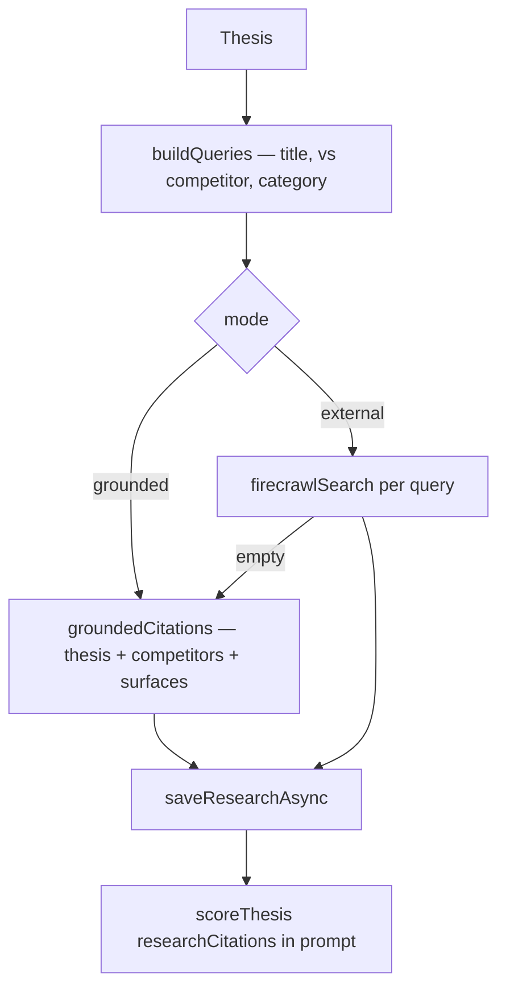
```mermaid
flowchart TD
  T[Thesis] --> Q[buildQueries — title, vs competitor, category]
  Q --> M{mode}
  M -->|grounded| GC[groundedCitations — thesis + competitors + surfaces]
  M -->|external| FC[firecrawlSearch per query]
  FC -->|empty| GC
  GC --> SAVE[saveResearchAsync]
  FC --> SAVE
  SAVE --> SCORE[scoreThesis researchCitations in prompt]
```

---

## Live re-rank

Challenge **step 3**: ingest new theses (JSON/CSV), score with Groq, merge into global ranking.

### UI flow

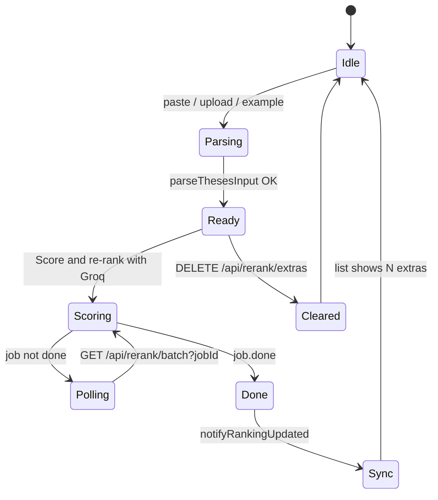
```mermaid
stateDiagram-v2
  [*] --> Idle
  Idle --> Parsing: paste / upload / example
  Parsing --> Ready: parseThesesInput OK
  Ready --> Scoring: Score and re-rank with Groq
  Scoring --> Polling: job not done
  Polling --> Scoring: GET /api/rerank/batch?jobId
  Scoring --> Done: job.done
  Done --> Sync: notifyRankingUpdated
  Sync --> Idle: list shows N extras
  Ready --> Cleared: DELETE /api/rerank/extras
  Cleared --> Idle
```

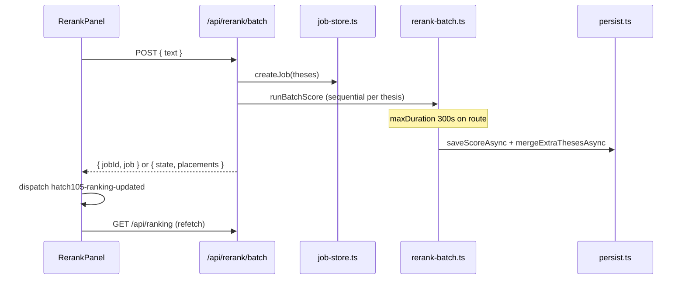
```mermaid
sequenceDiagram
  participant UI as RerankPanel
  participant API as /api/rerank/batch
  participant Job as job-store.ts
  participant RB as rerank-batch.ts
  participant Persist as persist.ts

  UI->>API: POST { text }
  API->>Job: createJob(theses)
  API->>RB: runBatchScore (sequential per thesis)
  Note over RB: maxDuration 300s on route
  RB->>Persist: saveScoreAsync + mergeExtraThesesAsync
  API-->>UI: { jobId, job } or { state, placements }
  UI->>UI: dispatch hatch105-ranking-updated
  UI->>API: GET /api/ranking (refetch)
```

### Batch job storage

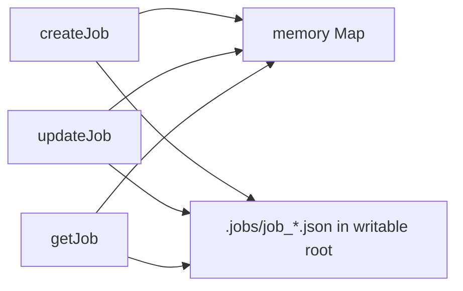
```mermaid
flowchart LR
  CJ[createJob] --> MEM[memory Map]
  CJ --> DISK[.jobs/job_*.json in writable root]
  UJ[updateJob] --> MEM
  UJ --> DISK
  GJ[getJob] --> MEM
  GJ --> DISK
```

**CLI alternative** (no browser timeout):

```bash
npm run rank -- --input fixtures/new_theses.json --merge
```

---

## Idea detail pages

Route: **`/ideas/[ref]`** — `dynamic = "force-dynamic"`, `dynamicParams = true`.

| Phase | Condition | UI |
|-------|-----------|-----|
| **Building** | Extra ref + `!isThesisProfileComplete` | `ThesisDetailBuilding` + spinner |
| **Full profile** | Base 50 or complete extra | `ThesisDetailPage` |

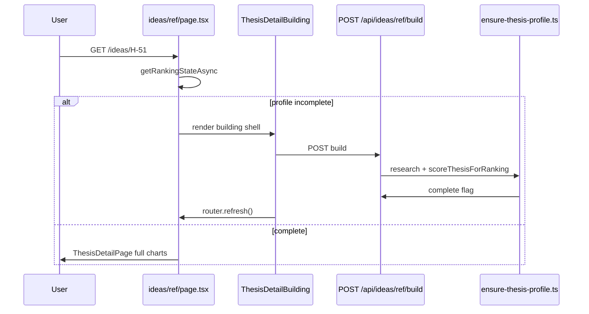
```mermaid
sequenceDiagram
  participant User
  participant Page as ideas/ref/page.tsx
  participant Build as ThesisDetailBuilding
  participant API as POST /api/ideas/ref/build
  participant Ens as ensure-thesis-profile.ts

  User->>Page: GET /ideas/H-51
  Page->>Page: getRankingStateAsync
  alt profile incomplete
    Page->>Build: render building shell
    Build->>API: POST build
    API->>Ens: research + scoreThesisForRanking
    Ens->>API: complete flag
    Build->>Page: router.refresh()
  else complete
    Page->>User: ThesisDetailPage full charts
  end
```

```mermaid
flowchart TD
  subgraph Sections["ThesisDetailPage sections"]
    W[WhyThisRank — thesis-insights.ts]
    G[RankGateTension]
    S[SimilarTheses]
    C[CriterionRadarChart + CompareBars]
    F[FitCohortChart]
    B[ThesisDetailBody — snapshot, v1Plan, trap]
    A[ThesisDetailActions — research, rescore, override]
  end
```

Profile completeness (`isThesisProfileComplete`) requires: full thesis fields, `technicalSnapshot`, full `v1Plan`, and `researchCitations`.

---

## Grounded chat

Chat is **not** RAG over the open web — it is **grounded in the ranking snapshot** built by [`lib/dataset-context.ts`](lib/dataset-context.ts) from `getRankingStateAsync()`.

```mermaid
flowchart TD
  U[User message] --> M[expandTeamMentionsAsync — lib/teams.ts]
  M --> API[POST /api/chat]
  API --> CTX[buildDatasetContext — top 8 detail + slim table]
  CTX --> SYS[buildChatSystemPrompt + RUBRIC_SUMMARY]
  SYS --> GROQ[streamText — getChatModel]
  GROQ --> SSE[UI message stream]
  SSE --> LINKS[formatTeamText → /ideas/ref links]
```

```mermaid
sequenceDiagram
  participant User
  participant Chat as /chat page
  participant API as /api/chat
  participant Teams as /api/teams
  participant Groq

  User->>Chat: @RefundRadar question
  Chat->>Teams: useTeams — autocomplete
  User->>API: POST messages
  API->>API: expandTeamMentionsAsync
  API->>Groq: streamText(system + dataset context)
  Groq-->>Chat: token stream
```

**Score handoff:** Chat can open `ScoreHandoffModal` → same batch API as Live re-rank → `notifyRankingUpdated`.

---

## Client-side ranking sync

[`lib/ranking-sync.ts`](lib/ranking-sync.ts) broadcasts `hatch105-ranking-updated` on `window` after live re-rank, clear extras, or chat handoff.

```mermaid
flowchart LR
  RP[RerankPanel / ScoreHandoffModal] --> EV[dispatch hatch105-ranking-updated]
  EV --> UT[useTeams — refetch /api/teams]
  EV --> RD[RankingDashboard — refetch /api/ranking]
  EV --> CP[compare-store — prune stale refs]
  EV --> PF[portfolio — prune stale refs]
```

Hooks: [`hooks/useTeams.ts`](hooks/useTeams.ts) also refetches on `window` **focus**.

---

## API reference

```mermaid
flowchart TB
  subgraph Public["Route Handlers — app/api/"]
    RANK[GET /api/ranking]
    BATCH[POST GET /api/rerank/batch]
    EXTRAS[GET DELETE /api/rerank/extras]
    TEAMS[GET /api/teams]
    CHAT[POST /api/chat]
    RES[GET POST /api/research/ref]
    OVR[POST /api/overrides/ref]
    BUILD[POST /api/ideas/ref/build]
  end

  subgraph Core["lib/"]
    DATA[data.ts]
    RB[rerank-batch.ts]
    DS[dataset-context.ts]
  end

  RANK --> DATA
  BATCH --> RB --> DATA
  EXTRAS --> DATA
  TEAMS --> DATA
  CHAT --> DS --> DATA
  RES --> DATA
  BUILD --> DATA
```

| Route | Method | `maxDuration` | Purpose |
|-------|--------|---------------|---------|
| `/api/ranking` | GET | default | Full `RankingState` + markdown |
| `/api/rerank/batch` | POST, GET | **300s** | Start/poll deterministic batch job |
| `/api/rerank/extras` | GET, DELETE | default | List/clear live additions |
| `/api/teams` | GET | default | `@` autocomplete from ranked list |
| `/api/chat` | POST | **60s** | Streaming grounded chat |
| `/api/research/[ref]` | GET, POST | default | Load/run grounded research (no rescore) |
| `/api/overrides/[ref]` | POST | default | Human criterion overrides |
| `/api/ideas/[ref]/build` | POST | **300s** | Backfill extra profile (deterministic) |

---

## Frontend architecture

```mermaid
flowchart TB
  subgraph Layout["app/layout.tsx"]
    VH[Vercel Analytics]
    HDR[AppHeader]
  end

  subgraph Pages["Pages"]
    HOME[page.tsx — RankingDashboard]
    IDEA[ideas/ref — ThesisDetailPage | Building]
    CHAT[chat — ChatPage]
    CMP[compare — ComparePage]
  end

  subgraph Components["components/"]
    RD[RankingDashboard]
    RT[RankingTable / TopThreeCards]
    RP[RerankPanel + RerankProgress]
    TDP[thesis/* charts + actions]
    CHC[chat/* composer + messages]
    CT[CompareTray]
  end

  HOME --> RD
  RD --> RT
  RD --> RP
  IDEA --> TDP
  CHAT --> CHC
  HOME --> CT
  IDEA --> CT
```

```mermaid
graph LR
  subgraph ClientState["Client state"]
    CS[compare-store — URL + session]
    PF[portfolio — localStorage]
    RJ[rerank jobId + progress items]
  end

  subgraph ServerState["Server state — JSON files"]
    SC[scores]
    ET[extra_theses]
    RS[research]
    OV[overrides]
  end

  RP[RerankPanel] --> RJ
  RJ --> ServerState
  RD[RankingDashboard] --> ServerState
```

---

## Environment variables

Copy [`.env.example`](.env.example) to `.env.local` (`.env*` is gitignored).

| Variable | Purpose |
|----------|---------|
| `GOOGLE_GENERATIVE_AI_API_KEY` | Gemini API — **Ask dataset chat only** (`/api/chat`) |
| `GEMINI_MODEL` | Default `gemini-2.0-flash` |
| `FIRECRAWL_API_KEY` | External research mode |
| `RESEARCH_DEFAULT_MODE` | `grounded` \| `external` |
| `CRITERIA_VERSION` | Rubric version stamped on each score |
| `BLOB_READ_WRITE_TOKEN` | **Vercel** — durable Blob persistence |
| `HATCH105_WRITABLE_DIR` | Override writable root (advanced) |

```mermaid
flowchart TD
  ENV[.env.local] --> GEMINI[GOOGLE_GENERATIVE_AI_API_KEY]
  ENV --> BLOB[BLOB_READ_WRITE_TOKEN]
  GEMINI --> CHAT[lib/models.ts → /api/chat]
  BLOB --> PERSIST[lib/persist.ts]
```

---

## Quick start

```bash
npm install
cp .env.example .env.local   # optional: GOOGLE_GENERATIVE_AI_API_KEY for /chat only
npm run seed                 # deterministic score base 50 → scores/*.json + RANKING.md
npm run dev                  # http://localhost:3000
```

The UI loads committed `scores/*.json` on first paint. Re-run `npm run seed` after rubric or model changes.

```mermaid
flowchart LR
  INSTALL[npm install] --> ENV[.env.local]
  ENV --> SEED[npm run seed]
  SEED --> DEV[npm run dev]
  DEV --> UI[localhost:3000]
```

---

## Scripts & tests

| Command | Description |
|---------|-------------|
| `npm run dev` | Next.js dev server (Turbopack) |
| `npm run build` | Production build; pre-renders static idea params |
| `npm run seed` | `scripts/seed-scores.ts` — score all candidates |
| `npm run rank -- --input <file> [--merge]` | CLI live re-rank |
| `npm test` | Vitest — gates, heuristic golden, team mentions |
| `npm run lint` | ESLint |

```mermaid
flowchart TD
  subgraph Tests["tests/"]
    G[gates-fit.test.ts]
    H[heuristic-golden.test.ts]
    I[thesis-insights.test.ts]
    T[teams-mention.test.ts]
  end
  G --> GATES[lib/gates.ts]
  H --> HEU[lib/heuristic.ts]
```

---

## Deploy on Vercel

```mermaid
flowchart TD
  A[Import GitHub repo] --> B[Add Blob store — Storage]
  B --> C[Set GOOGLE_GENERATIVE_AI_API_KEY in project env]
  C --> D[Deploy]
  D --> E{Live re-rank?}
  E -->|yes| F[BLOB_READ_WRITE_TOKEN auto-injected]
  E -->|read-only| G[Committed scores/ enough for base 50]
  F --> H[Extras survive refresh]
```

1. Import the repo on [Vercel](https://vercel.com).
2. **Storage → Blob** — create and link a store (required for live re-rank persistence).
3. Set `GOOGLE_GENERATIVE_AI_API_KEY` (and optional vars above).
4. Committed `scores/*.json` lets the rankings UI work on cold start without Gemini.

```bash
npx vercel --prod
```

---

## Confidentiality & license

Theses in `Initial-dataset/` are **confidential** per the challenge brief — do not redistribute outside the review process.

**License:** Private challenge submission — see repository owner for usage terms.

---

<p align="center">
  
  <br />
  <em>Groq-powered seed run — <code>npm run seed</code> writing auditable <code>scores/H-XX.json</code></em>
</p>
