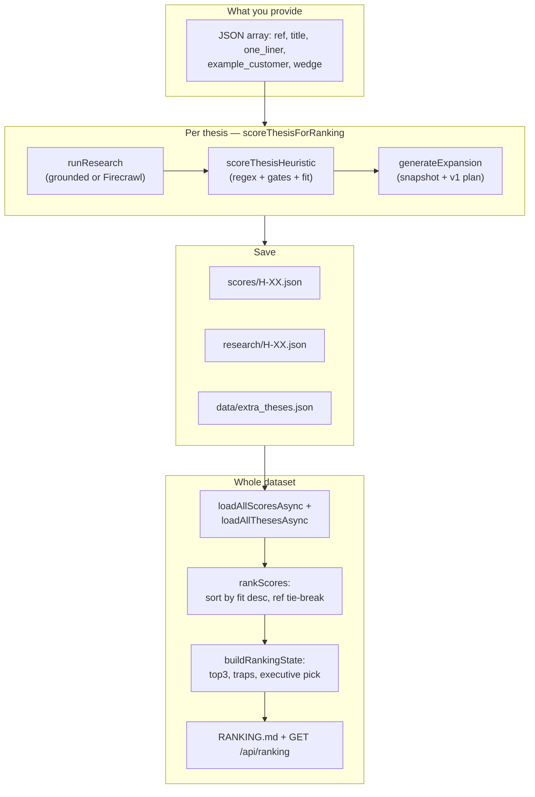
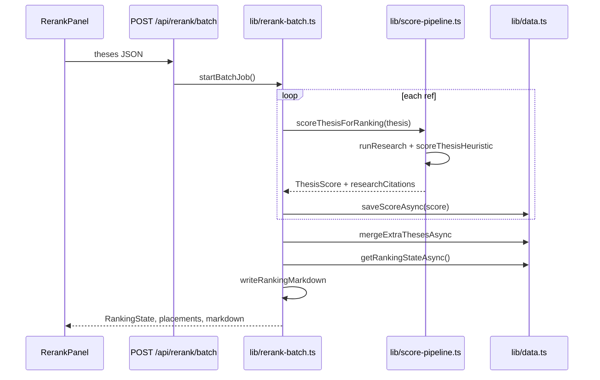
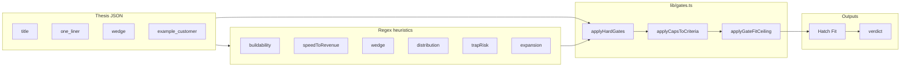
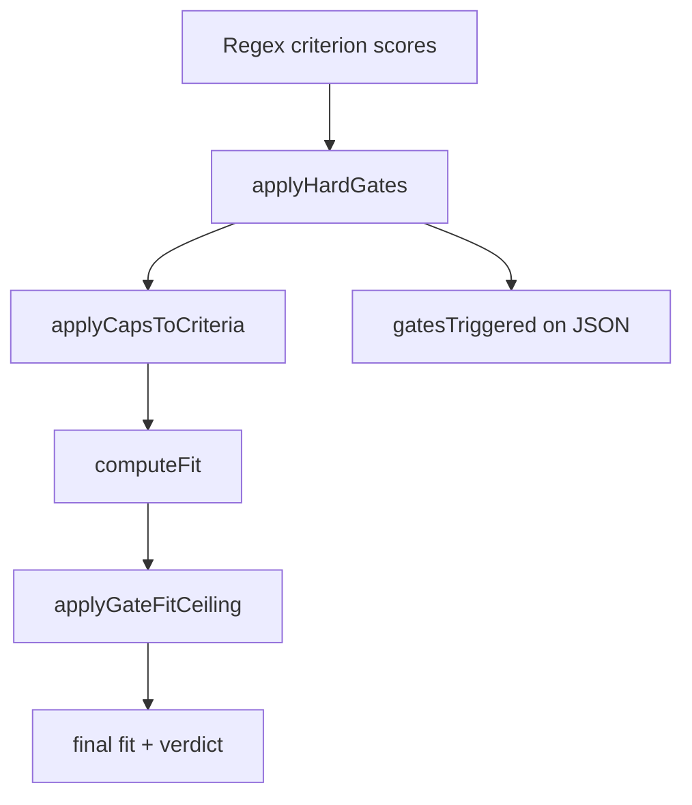
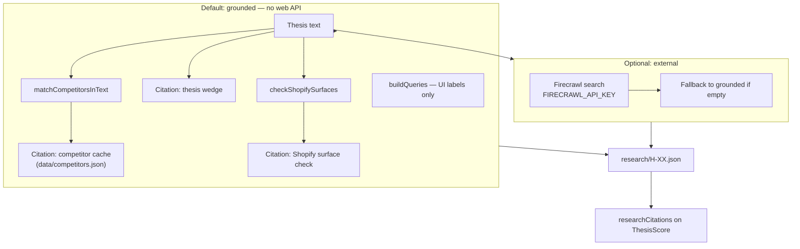
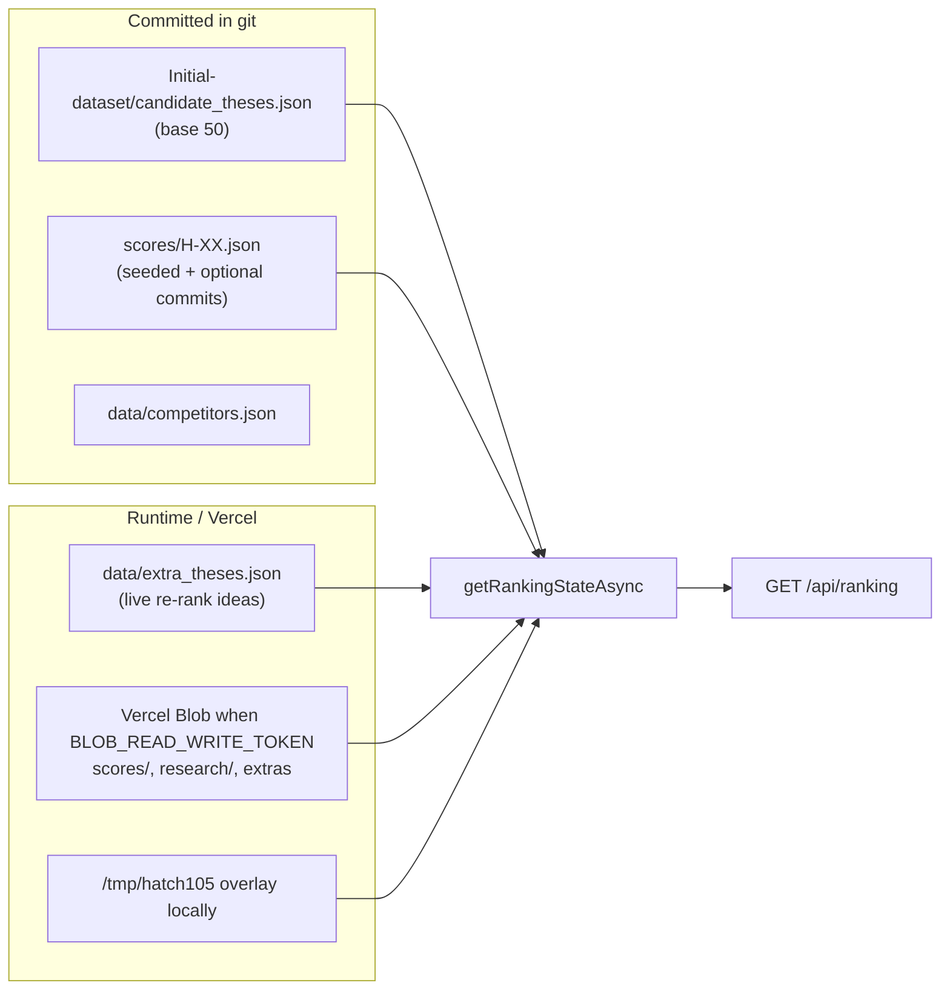
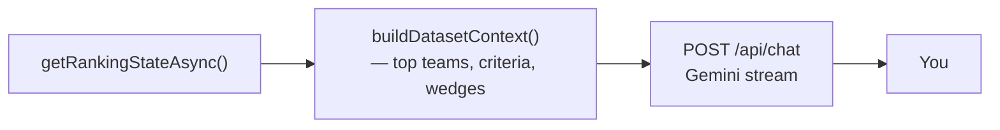

# How Hatch105 ranking works

This document explains how theses are scored, researched, sorted, and surfaced in the UI. It is the human-readable companion to the implementation in `lib/heuristic.ts`, `lib/gates.ts`, `lib/score-pipeline.ts`, and `lib/rank.ts`.

> **Note:** [`RANKING.md`](../RANKING.md) at the repo root is **auto-generated** after each live re-rank (executive pick, top 10 table, full list). This file is **stable documentation** — it does not change when you re-rank.

---

## Table of contents

1. [One-minute summary](#one-minute-summary)
2. [What uses an LLM (and what does not)](#what-uses-an-llm-and-what-does-not)
3. [End-to-end flow](#end-to-end-flow)
4. [Inputs: what we read from each thesis](#inputs-what-we-read-from-each-thesis)
5. [Scoring: six criteria](#scoring-six-criteria)
6. [Hard gates and fit ceilings](#hard-gates-and-fit-ceilings)
7. [Hatch Fit and verdicts](#hatch-fit-and-verdicts)
8. [Research (citations)](#research-citations)
9. [Expansion (detail-page narrative)](#expansion-detail-page-narrative)
10. [Sort order and dashboard buckets](#sort-order-and-dashboard-buckets)
11. [Persistence and data sources](#persistence-and-data-sources)
12. [Live re-rank (batch)](#live-re-rank-batch)
13. [Ask dataset chat](#ask-dataset-chat)
14. [Human overrides](#human-overrides)
15. [Source file map](#source-file-map)

---

## One-minute summary

Each company is a **thesis** (five JSON fields). The app:

1. Optionally runs **research** (grounded competitor/surface cache, or Firecrawl if configured).
2. **Scores** six rubric criteria with **regex rules** on thesis text (no LLM).
3. Applies **hard gates** that can cap individual criteria and total fit.
4. Computes a weighted **Hatch Fit** number.
5. **Sorts** all scored theses by fit (highest first).
6. Builds **dashboard buckets** (executive pick, top 3, traps).

**Research does not change numeric scores today** — it supplies citations and profile completeness for idea detail pages.

---

## What uses an LLM (and what does not)

| Feature | Engine | API / module |
|---------|--------|----------------|
| **Ranking, re-rank, criterion scores** | Deterministic heuristic + gates | `lib/heuristic.ts`, `lib/gates.ts`, `lib/score-pipeline.ts` |
| **Detail snapshot / v1 plan text** | Template expansion | `lib/expansion.ts` |
| **Ask dataset chat** | Google Gemini (`gemini-2.5-flash` default) | `app/api/chat/route.ts`, `lib/dataset-context.ts` |

Legacy scores in `scores/H-XX.json` may still show `scoredWith: "groq"` or `"gemini"` from earlier seeds. **New live re-ranks** write `scoredWith: "heuristic"`.

---

## End-to-end flow

### Live re-rank and first-time scoring



### Sequence: batch API



Entry points:

- **Pipeline:** [`lib/score-pipeline.ts`](../lib/score-pipeline.ts) — `scoreThesisForRanking()`
- **Batch:** [`lib/rerank-batch.ts`](../lib/rerank-batch.ts) — `runBatchScore()`, `finalizeRanking()`

---

## Inputs: what we read from each thesis

### Thesis JSON (required for scoring)

| Field | Used for |
|-------|----------|
| `ref` | Identity, ref-specific calibration (`REF_ADJUSTMENTS`), tie-break in sort |
| `title` | Concatenated scoring blob |
| `one_liner` | Scoring blob + wedge-clarity heuristics |
| `wedge` | Scoring blob, research citations, surface checks |
| `example_customer` | Distribution scoring (ICP revenue band) |

All criterion regexes run on a **lowercased blob**:

```text
title + one_liner + wedge + example_customer
```

(`scoreThesisHeuristic` uses `title + one_liner + wedge` for most criteria; distribution also uses `example_customer`.)

### What scoring does **not** read

- Live web pages (unless you use **external** research — and even then, research is **not** fed into the scorer).
- Prior chat messages.
- Other teams’ scores at scoring time (each thesis is scored independently; cohort sort happens after all scores exist).

---

## Scoring: six criteria

Each criterion is scored **1–5** with a short `reason` and an `evidence` tag (`sourced` | `inferred` | `guess`).

Implementation: [`lib/heuristic.ts`](../lib/heuristic.ts).

### Weights (Hatch Fit)

From [`lib/criteria.ts`](../lib/criteria.ts):

| Criterion | Weight | Label in UI |
|-----------|--------|-------------|
| `buildability` | **25%** | Buildability (10 weeks) |
| `speedToRevenue` | **20%** | Speed to revenue |
| `wedge` | **15%** | Wedge clarity |
| `distribution` | **15%** | Distribution to ICP |
| `trapRisk` | **10%** | Trap risk (safety) |
| `expansion` | **15%** | Expansion path |



### Buildability (25%)

**Favors:** thin Shopify surfaces — theme app extension, checkout extension/block, Liquid/metafields, back-in-stock webhooks, SMS-on-OOS patterns.

**Penalizes:** generative 3D, realtime multimodal, heavy POS/B2B/crawler/repricing-agent scope, non-trivial ML pipelines.

**Examples of high-signal phrases:**

- Score 5: `theme app extension`, `checkout block`, `zero external javascript`, `back.in.stock`
- Score 1: `generative 3d`, `3d mesh`, `realtime api`, `voice clone`

### Speed to revenue (20%)

**Favors:** per-save / success-fee pricing, flat `$19/mo` / `$29/mo`, App Store self-serve, day-1 value (WISMO, OOS, failed subscription recovery).

**Penalizes:** enterprise migration, habit-change products, long setup.

### Wedge clarity (15%)

**Favors:** short combined `one_liner + wedge`, painful-moment fixes (`wismo`, `oos`, `failed subscription`, `when a watched variant`).

**Penalizes:** platform/dashboard “three apps” positioning, vague persona/scorecard plays.

### Distribution (15%)

**Favors:** `example_customer` and wedge mentioning sub-$1M DTC, `$50k–$2M`, Shopify App Store motion.

**Penalizes:** POS, $10M+ merchants, Recharge/Klaviyo-enterprise motion, narrow verticals.

### Trap risk (10%)

**Known trap refs** (forced low): `H-03`, `H-11`, `H-20`, `H-32`, `H-41` (see also `TRAP_REFS` in criteria).

**Penalizes:** `vs yotpo/gorgias/klaviyo`, autonomous repricing, realtime traps.

**Favors:** differentiated placement vs incumbents without pure price war.

### Expansion (15%)

**Favors:** same-workflow expansion (WISMO → more support automation, dunning, catalog health).

**Penalizes:** single-feature/seasonal ceilings, vertical lock-in.

### Ref-specific calibration

After regex scoring, selected refs are **manually adjusted** for dataset sanity (`REF_ADJUSTMENTS` in `heuristic.ts`), e.g.:

- Boosts: `H-08`, `H-48`, `H-47`, `H-33`, `H-29`
- Demotes: `H-03`, `H-32`, `H-20`, `H-11`, `H-41`, `H-25`

Reason strings gain: `[Calibrated for Hatch dataset.]`

### Shopify surface flags

[`lib/shopify-surfaces.ts`](../lib/shopify-surfaces.ts) detects checkout/theme/functions/webhook/POS/headless mentions and attaches `surfaceFlags` on the score (informational + expansion templates). Surface detection does not replace criterion regexes.

---

## Hard gates and fit ceilings

Gates run **after** raw criterion scores and **before** final fit. Pure TypeScript — same result every time.

Implementation: [`lib/gates.ts`](../lib/gates.ts).

| Gate ID | Trigger (summary) | Criterion caps |
|---------|-------------------|----------------|
| `G3D` | Generative 3D / AR try-on / wearable 3D | `buildability` ≤ 2 |
| `REALTIME_AI` | Realtime API, live video, voice clone, &lt;300ms | `buildability` ≤ 2 |
| `INCUMBENT_WAR` | vs Yotpo/Gorgias/Klaviyo **and** price language | `trapRisk` ≤ 2 |
| `POS_ENTERPRISE` | Shopify POS / POS return | `distribution` ≤ 3 |
| `AUTO_REPRICE` | Closed-loop / autonomous repricing | `trapRisk` ≤ 2 |



### Composite fit ceilings

Even after weighted average, gates can **cap total fit**:

| Condition | Max fit |
|-----------|---------|
| `G3D` or `REALTIME_AI` | **2.75** |
| `AUTO_REPRICE` | **3.15** |
| `POS_ENTERPRISE` only (single gate) | **3.35** |

---

## Hatch Fit and verdicts

### Formula

```text
fit = round(
  0.25 × buildability
+ 0.20 × speedToRevenue
+ 0.15 × wedge
+ 0.15 × distribution
+ 0.10 × trapRisk
+ 0.15 × expansion
, 2)
```

Then `applyGateFitCeiling(fit, gatesTriggered)` may lower the result.

### Verdict bands

From [`verdictFromFit`](../lib/criteria.ts):

| Fit range | Verdict |
|-----------|---------|
| ≥ 4.2 | **Strong Hatch fit** |
| ≥ 3.5 | **Viable with scope discipline** |
| ≥ 2.8 | **Borderline — cut scope** |
| &lt; 2.8 | **Trap or wrong team size** |

---

## Research (citations)

Research runs inside `scoreThesisForRanking()` **before** heuristic scoring but **does not change** the 1–5 criterion scores.

Implementation: [`lib/research.ts`](../lib/research.ts).



| Mode | Env | Behavior |
|------|-----|----------|
| **grounded** | `RESEARCH_DEFAULT_MODE=grounded` (default) | Wedge snippet + competitor facts + surface messages from local caches |
| **external** | `RESEARCH_DEFAULT_MODE=external` + `FIRECRAWL_API_KEY` | Up to 3 Firecrawl search hits; falls back to grounded if API missing or empty |

**Idea page “Refresh snippets”** (`POST /api/research/[ref]`) updates `research/*.json` only — it does **not** re-score or change rank.

---

## Expansion (detail-page narrative)

[`lib/expansion.ts`](../lib/expansion.ts) generates:

- `technicalSnapshot` — stack/surface summary from thesis + flags + gates
- `v1Plan` — `{ day3, week3, week10 }` milestone strings
- `trapNote` — optional warning when gates or low trapRisk

Templates are chosen from surface kind (theme extension, checkout, webhooks, POS, etc.) and criterion scores. **Not an LLM.**

Profile completeness ([`lib/ensure-thesis-profile.ts`](../lib/ensure-thesis-profile.ts)) requires thesis fields plus snapshot, v1 plan, and `researchCitations`.

---

## Sort order and dashboard buckets

### Sorting

[`lib/rank.ts`](../lib/rank.ts) — `rankScores()`:

1. Sort all `ThesisScore` by **`fit` descending**
2. Tie-break: **`ref` ascending** (locale-aware string compare)
3. Assign `rank: 1, 2, 3, …`
4. Attach optional `thesis` object for UI

**No ML reranker.** Placement is entirely explained by stored criterion scores and gates.

### Dashboard state

[`lib/markdown.ts`](../lib/markdown.ts) — `buildRankingState()`:

| UI section | Rule |
|------------|------|
| **Executive pick** | Rank #1 + MVP blurb from `MVP_BY_REF` or `DEFAULT_MVP` |
| **Trap demoted** | Default narrative around `H-03` (FittingRoom3D) or first `G3D` gate |
| **Top 3** | First three in sorted list |
| **Traps tab** | Gates triggered, or fit &lt; 3.3, or `trapRisk` ≤ 2 |
| **All ideas** | Full `ranked` array |

[`lib/rank.ts`](../lib/rank.ts) — `getTraps()` also includes known trap refs from `TRAP_REFS` and fit &lt; 3.2.

### Placement summary after re-rank

`placementSummary()` describes where new refs landed vs neighbors and their strongest criterion — used in batch API responses.

---

## Persistence and data sources



Load order for scores ([`lib/data.ts`](../lib/data.ts)):

1. Repo `scores/` directory
2. Blob-listed `scores/*.json` (overrides by ref)
3. Local writable overlay when configured

---

## Live re-rank (batch)

**UI:** Home → **Live re-rank** → paste JSON array → **Score & re-rank**.

**API:** `POST /api/rerank/batch` with `{ text }` or `{ theses }`.

**Steps:**

1. Parse and validate theses (`lib/parse-theses.ts`)
2. Create job in job store (`lib/job-store.ts`)
3. For each ref: `scoreThesisForRanking` → `saveScoreAsync`
4. `mergeExtraThesesAsync` — append to extras list
5. `getRankingStateAsync` → `writeRankingMarkdown` → return state + placements

**Clear extras:** `DELETE /api/rerank/extras` removes live-added theses from ranking (scores may remain on disk until manually removed).

**Client sync:** `hatch105-ranking-updated` event ([`lib/ranking-sync.ts`](../lib/ranking-sync.ts)) triggers dashboard refetch.

---

## Ask dataset chat

Chat is **not** the scorer. It reads a **frozen markdown snapshot** of the current ranking.



- Module: [`lib/dataset-context.ts`](../lib/dataset-context.ts)
- Route: [`app/api/chat/route.ts`](../app/api/chat/route.ts)
- Model: [`lib/models.ts`](../lib/models.ts) — default `gemini-2.5-flash`

Re-rank first if you want chat to discuss newly added companies.

---

## Human overrides

On an idea detail page, editors can adjust criterion scores. Overrides:

- Recompute **fit** via `computeFit`
- Persist in override store ([`lib/override.ts`](../lib/override.ts))
- Change **rank** on next full ranking load (sort uses updated fit)

Overrides are intentional human judgment on top of the heuristic baseline.

---

## Source file map

| Concern | File |
|---------|------|
| Orchestration | [`lib/score-pipeline.ts`](../lib/score-pipeline.ts) |
| Regex scoring + ref calibration | [`lib/heuristic.ts`](../lib/heuristic.ts) |
| Weights, verdicts, trap ref set | [`lib/criteria.ts`](../lib/criteria.ts) |
| Hard gates + fit ceiling | [`lib/gates.ts`](../lib/gates.ts) |
| Detail narrative templates | [`lib/expansion.ts`](../lib/expansion.ts) |
| Research / citations | [`lib/research.ts`](../lib/research.ts) |
| Competitor cache | [`lib/competitors.ts`](../lib/competitors.ts), [`data/competitors.json`](../data/competitors.json) |
| Shopify surfaces | [`lib/shopify-surfaces.ts`](../lib/shopify-surfaces.ts) |
| Sort + placement copy | [`lib/rank.ts`](../lib/rank.ts) |
| Executive pick / markdown export | [`lib/markdown.ts`](../lib/markdown.ts) |
| Load merge + ranking state | [`lib/data.ts`](../lib/data.ts) |
| Batch re-rank | [`lib/rerank-batch.ts`](../lib/rerank-batch.ts) |
| Chat context | [`lib/dataset-context.ts`](../lib/dataset-context.ts) |
| Generated ranking table | [`RANKING.md`](../RANKING.md) (auto) |

### Tests

- [`tests/heuristic.test.ts`](../tests/heuristic.test.ts) — golden scores for key refs
- [`tests/gates.test.ts`](../tests/gates.test.ts) — gate triggers and ceilings
- [`tests/expansion.test.ts`](../tests/expansion.test.ts) — expansion templates

Run: `npm test`

---

## Related docs

- [README.md](../README.md) — architecture, API reference, env vars
- [RANKING.md](../RANKING.md) — latest generated ranking snapshot (changes after each re-rank)
